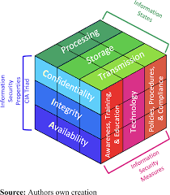

# Module 1: Introduction on Cybersecurity

### Defining Cybersecurity

Cybersecurity is the continuous effort to protect individuals, organizations, and governments from digital attacks. It is categorized into three main levels:

* Personal: Protecting identity, personal data, and devices.
* Corporate: Responsibility to protect company reputation, proprietary data, and customer information.
* Governmental: Focused on national security, economic stability, and the citizens' well-being.\
  \
  \*\*Data Privacy: Once data is on the internet, it is nearly impossible to delete it completely. Criminals focus on long-term gains through identity theft.\*\* 

### Information States and Types

Data is any information that can be used for identification.

* Offline Identity: Your real-life identity (Family, school, work).
* Online Identity (Digital Shadow): How you are represented online (Usernames, social media behavior, digital footprints).
* Organizational Data:
  * Traditional: Transactional data, intellectual property (patents/ideas), and financial records.
  * IoT & Big Data: The massive volume of data generated automatically by interconnected devices (sensors, smartwatches) that requires advanced analysis for decision-making.

### The McCumber Cube (The Framework)

The McCumber Cube is a professional security model used to evaluate and manage information security through three dimensions:

#### A. The CIA Triad (Security Principles)

* Technology: Hardware/Software solutions (Firewalls, encryption).
* Policies & Procedures: Rules and guidelines established by the organization.
* Awareness & Education: Training people to recognize and prevent threats.

#### B. Data States

1. Confidentiality: Ensuring only authorized users access the data.
2. Integrity: Ensuring data remains accurate and hasn't been tampered with.
3. Availability: Ensuring data is accessible when needed.

#### C. Safeguards (Security Measures)

* Technology: Hardware/Software solutions (Firewalls, encryption).
* Policies & Procedures: Rules and guidelines established by the organization.
* Awareness & Education: Training people to recognize and prevent threats.

<figure><figcaption></figcaption></figure>

### Threat Actors (The "Who")

Understanding the profiles of cyber-attackers is crucial for defensive and offensive security.

#### Per Intent (Hackers)

* White Hat: Ethical hackers who work with authorization to improve security.
* Black Hat: Malicious actors seeking personal/financial gain or power.
* Grey Hat: Intermediate profile; may hack without authorization but doesn't necessarily have malicious intent.
* Script Kiddies: Beginners who use pre-made tools from the internet with little technical understanding.

#### Organized Groups

* Hacktivists: Driven by political or social causes.
* Cybercriminals: Focused strictly on financial profit.
*   State-Sponsored: Highly sophisticated groups performing espionage or sabotage for a government.\
     

    ### Cyber Warfare & Case Studies

    Cyber warfare involves the use of digital attacks to cause disorder, steal secrets, or destroy infrastructure.

    #### The Stuxnet Case

    Stuxnet is one of the most sophisticated malwares ever created.

    * Target: Iran's nuclear program (Industrial Control Systems - PLCs).
    * Method: Spread mainly via infected USB drives (bypassing the "air gap").
    * Goal: Physical sabotage. It caused centrifuges to spin at irregular speeds until they were destroyed, while hiding the failure from the operators.
    * Significance: It proved that a digital attack could cause massive physical damage to a nation's critical infrastructure.
